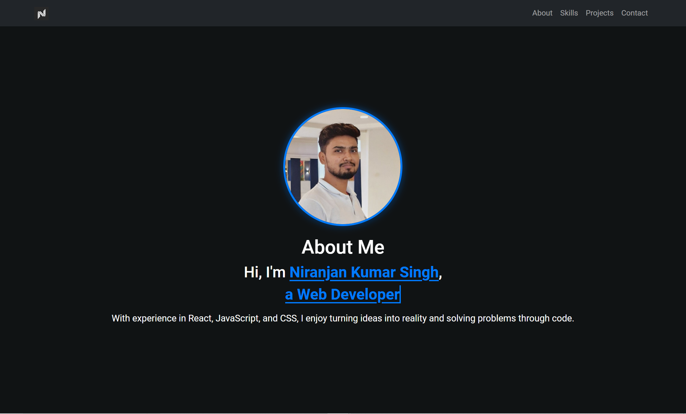

# 🌟 Niranjan Kumar Singh - Developer Portfolio 🌟

**Welcome to my digital playground!** 🎉  
This portfolio is a reflection of my passion for web development and creative problem-solving. Dive in, explore my projects, learn about my skills, and discover what drives me as a developer!

---

## 🌐 Explore the Live Site

Curious to see it in action?  
🔗 **[Check out the live portfolio here!](https://niranjansinghportfolio.netlify.app)**

---

## 🔥 Why You’ll Love This Portfolio

- 🧑‍💻 **About Me**: Get a glimpse into my journey—what motivates me, my vision, and what I bring to the table as a developer.
- 🚀 **Featured Projects**: A carefully curated collection of projects that demonstrate my expertise and creativity. From sleek web apps to dynamic user interfaces, it's all here!
- 🎯 **Skills & Expertise**: A breakdown of the technologies I love to work with—everything from frontend magic to backend logic.
- 📬 **Contact Me**: Got a project idea or just want to connect? Use the clean, interactive contact form to reach out!
- 📱 **Fully Responsive**: Whether you're on a desktop, tablet, or phone, the experience is smooth and intuitive across all screen sizes.

---

## 💡 Core Technologies

This portfolio is a blend of cutting-edge technologies designed to deliver both performance and aesthetics:

- **React** – For building interactive and dynamic user interfaces.
- **HTML5 & CSS3** – The backbone of web design, ensuring clean and modern visuals.
- **JavaScript** – Bringing the portfolio to life with interactivity.
- **Bootstrap** – Powering the responsiveness for a flawless experience across devices.
- **Netlify** – Hosting the portfolio for lightning-fast performance.

---

## 🎬 Visual Tour

Take a quick peek at the portfolio with this visual overview:



---

## ⚙️ How to Get This Running Locally

Want to dig deeper? Clone and explore the portfolio on your own machine!

### Pre-requisites

- **Node.js** and **npm** installed.
- **Git** installed.

### Installation Steps

1. **Clone the Repository**

   ```bash
   git clone https://github.com/Niranjan-Kumar-Singh/my-portfolio.git
   ```

2. **Navigate to the Project Directory**

   ```bash
   cd my-portfolio
   ```

3. **Install Dependencies**

   ```bash
   npm install
   ```

4. **Start the Local Server**

   ```bash
   npm start
   ```

   Your portfolio will be live at `http://localhost:3000`! 🎉

---

## 🛠️ Featured Projects

Here’s a taste of some projects you’ll find inside the portfolio:

- **Weather Forecast App**: A real-time weather app using OpenWeatherMap API.
- **Text Counter App**: A text analysis tool that counts words, characters, and readability scores.
- **News App**: A real-time news app pulling headlines from multiple categories using an API.

These projects highlight my technical skills and love for building practical web apps that solve real-world problems.

---

## 🤝 Contributions Welcome!

Whether you’re a developer wanting to collaborate, or you’ve found a cool new feature idea, feel free to contribute! Fork the repo, add your magic, and submit a pull request. Let’s create something awesome together! ✨

---

## 📞 Let’s Get in Touch!

I’m always open to exciting new opportunities, collaborations, or just a friendly chat!  
Reach out to me via:

- **Email**: [niranjansingh1419@gmail.com](mailto:niranjansingh1419@gmail.com)
- **GitHub**: [Niranjan-Kumar-Singh](https://github.com/Niranjan-Kumar-Singh)
- **LinkedIn**: [Niranjan-Kumar-Singh](https://www.linkedin.com/in/niranjan-kumar-singh/)

---

### 💬 Final Thoughts

Thank you for taking the time to check out my portfolio. I’ve poured a lot of effort into every project and detail, and I hope you enjoy exploring it as much as I enjoyed building it! 🙌  
Let’s connect, create, and innovate! 🚀
